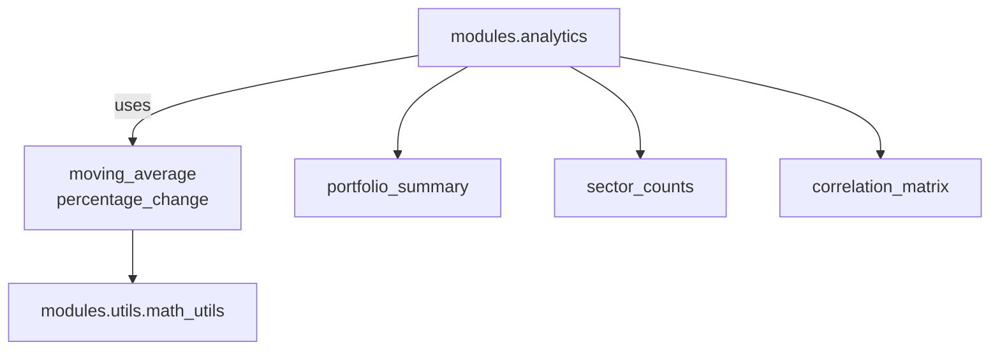

# Analytics Utilities

The `modules.analytics` package contains small, dependency-free helpers used across the CLI commands and notebooks. They provide quick insights on portfolio DataFrames and expose a couple of common calculations from `modules.utils.math_utils`.

## Provided Functions

- **`portfolio_summary(df)`** – return mean, minimum and maximum statistics for each numeric column.
- **`sector_counts(df)`** – count how many tickers fall into each sector.
- **`correlation_matrix(df)`** – compute a Pearson correlation matrix for numeric columns.
- **`moving_average(series, window)`** – rolling mean imported from `math_utils`.
- **`percentage_change(series, periods=1)`** – percent change from prior values, also from `math_utils`.

## Relationships

The diagram highlights how the analytics helpers primarily rely on `math_utils` for calculations while remaining otherwise self contained.

