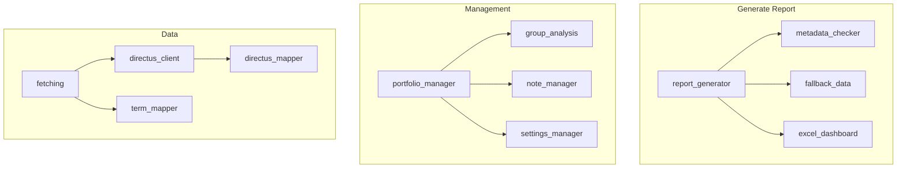

# Module Diagrams

```mermaid
graph TD;
    subgraph Generate Report
        A[report_generator] --> B[metadata_checker]
        A --> C[fallback_data]
        A --> D[excel_dashboard]
    end
    subgraph Management
        E[portfolio_manager] --> F[group_analysis]
        E --> G[note_manager]
        E --> H[settings_manager]
    end
    subgraph Data
        I[fetching] --> J[directus_client]
        J --> K[directus_mapper]
        I --> L[term_mapper]
    end
```
