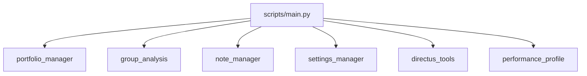

# Command Line Utilities

The `scripts/` directory provides entry points for everyday tasks while the
`modules.management` package implements the interactive menus. Everything is
accessible through `scripts/main.py` but individual tools can be executed on
their own.

## Main Scripts

- `main.py` – central CLI with subcommands and an interactive menu.
- `note_cli.py` – quick launcher for the note manager.
- `performance_profile.py` – benchmark helper for internal functions.
- `sync_directus_fields.py` – update `directus_field_map.json` from your Directus
  instance.

## Management Modules

- `portfolio_manager` – maintain your portfolio spreadsheet.
- `group_analysis` – manage related ticker groups.
- `note_manager` – create markdown notes with `[[wikilinks]]`.
- `settings_manager` – edit `config/settings.json` and run setup wizards.
- `directus_tools` – miscellaneous Directus helpers.

## Diagram

