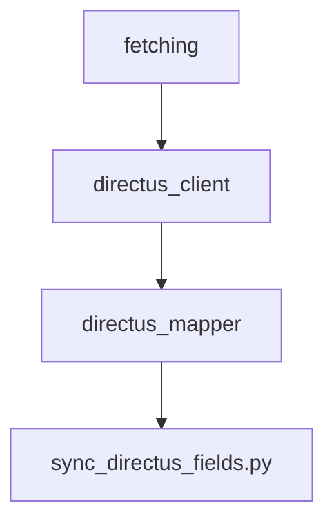

# Directus Integration

Fundalyze can upload retrieved data to a [Directus](https://directus.io/) instance. The
modules under `modules/data/` provide thin wrappers around the Directus REST API and
helpers for mapping local column names to collection fields.

## Key Modules

- `directus_client.py` – HTTP helper functions for querying and updating Directus.
- `directus_mapper.py` – maintains `config/directus_field_map.json` describing how
  DataFrame columns map to collection fields.
- `fetching.py` – general data retrieval; used when syncing with Directus.

The script `scripts/sync_directus_fields.py` connects to your Directus server and
interactively updates `directus_field_map.json` so the mapping stays in sync.

## Configuration

Set the following variables in `config/.env`:

```env
DIRECTUS_URL=https://your-instance.example.com
DIRECTUS_API_TOKEN=your-token
CF_ACCESS_CLIENT_ID=optional-id
CF_ACCESS_CLIENT_SECRET=optional-secret
```

Collections and field names can be customized in `directus_field_map.json`.

## Diagram


