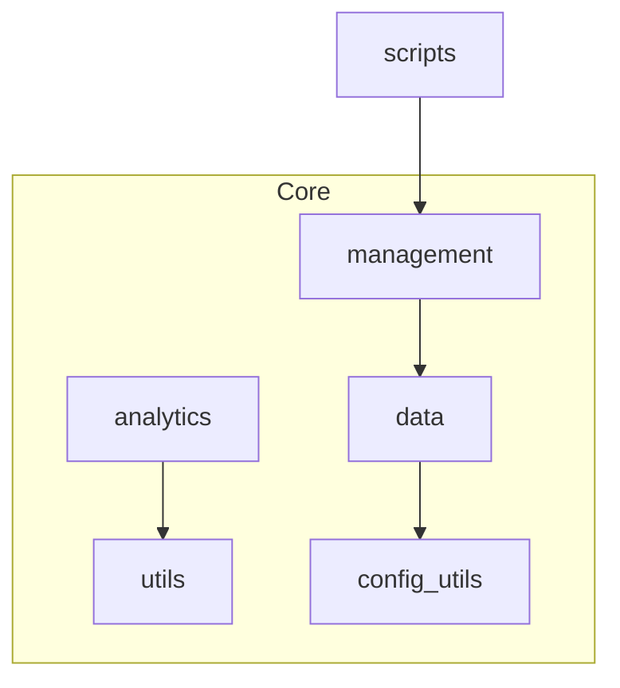

# Module Relationships

```mermaid
graph TD;
    subgraph Core
        analytics --> utils
        data --> config_utils
        management --> data
    end
    scripts --> management
```

The diagram highlights the high level dependencies between major packages.
