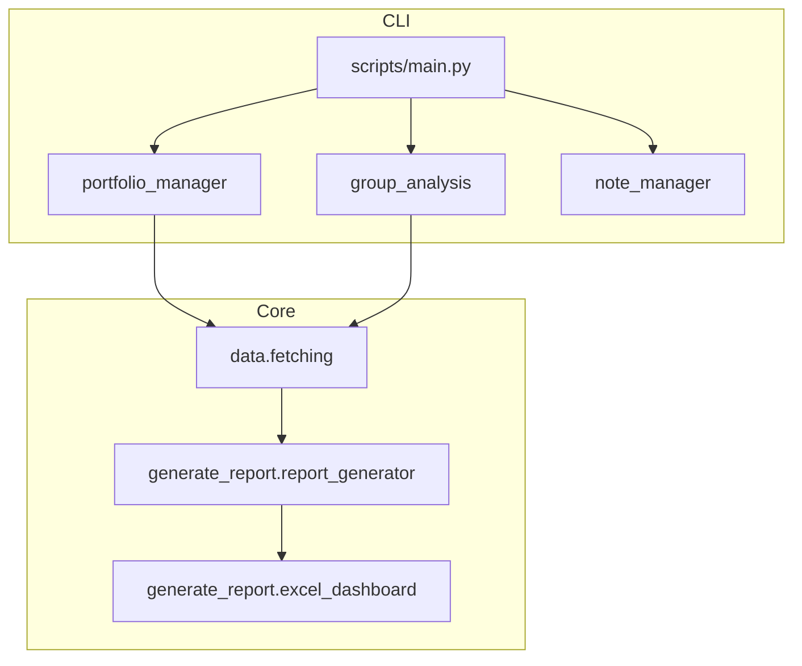

# Codebase Overview

This document summarizes the key modules and entry points in **Fundalyze**. Use it as a quick reference when navigating or extending the project.

## Module Packages

### `modules.generate_report`
Utilities for building ticker reports and Excel dashboards.
- `report_generator.py` – fetches profile data, price history and financial statements via OpenBB, saving each dataset under `output/<TICKER>/`.
- `metadata_checker.py` – scans downloaded metadata for errors and attempts to re‑fetch missing information.
- `fallback_data.py` – performs a full yfinance fallback when primary sources fail.
- `excel_dashboard.py` – combines individual CSV files into a multi‑sheet Excel workbook.

The package exposes the convenience function `run_generate_report()` which orchestrates all of the above steps.

### `modules.management`
Tools for maintaining local data files:
- `portfolio_manager` – CLI for creating and editing `portfolio.xlsx`.
- `group_analysis` – manage related tickers in `groups.xlsx`.
- `note_manager` – simple Markdown note system supporting `[[wikilinks]]`.

For a walkthrough of each CLI and a diagram of the management package layout see
[Management Tools](management_tools.md).

Importing `modules.management` exposes convenience functions such as
`run_portfolio_manager()` and `run_group_analysis()` for launching each tool
directly.

### `modules.data`
Lower-level helpers used across the app (see [modules/data/README.md](../modules/data/README.md)):
- `fetching.py` – wrappers around yfinance with FMP fallback.
- `directus_client.py` – optional Directus integration for remote storage.
- `directus_mapper.py` – keeps `directus_field_map.json` in sync and prepares records for upload.
- `term_mapper.py` – maps common financial terms to canonical names.
- `compare.py` – compares profile data from different providers.

### `modules.utils`
Small helper utilities reused across the codebase:
- `data_utils.py` – safe CSV/JSON loading helpers.
- `excel_utils.py` – convenience wrappers for writing Excel tables.
- `math_utils.py` – calculations like moving averages and percentage change.
- `progress_utils.py` – optional progress indicator wrapper.

See [docs/utils_overview.md](utils_overview.md) for examples and additional
details on these helpers as well as logging setup.

### `modules.analytics`
Lightweight portfolio analysis helpers:
- `portfolio_summary` – mean, min and max statistics for numeric columns.
- `sector_counts` – distribution of tickers by sector.
- `correlation_matrix` – Pearson correlation matrix for numeric data.

### `modules.analytics`
Lightweight portfolio analysis helpers:
- `portfolio_summary` – mean, min and max statistics for numeric columns.
- `sector_counts` – distribution of tickers by sector.
- `correlation_matrix` – Pearson correlation matrix for numeric data.

### `modules.config_utils`
Loads environment variables from `config/.env` and user settings from `config/settings.json`. Call `load_settings()` once during startup so other modules can access configuration values via `os.getenv()` or the returned dictionary.

### `modules.logging_utils`
Provides `setup_logging()` which configures the root logger and creates
`fundalyze.log`. See [logging.md](logging.md) for usage details.

## Script Entry Points

The `scripts/` directory contains small wrappers that import the modules above and can be run directly. See [scripts_overview.md](scripts_overview.md) for a full description of each entry point.

- `main.py` – interactive menu and command-line interface. It provides access to portfolio and group management, reporting utilities, the note manager, settings and Directus tools.
- `note_cli.py` – legacy entry point equivalent to running `main.py notes`.
- `performance_profile.py` – micro-benchmark utility.

Running `python scripts/main.py` without arguments opens the interactive menu; see the README for command examples.
