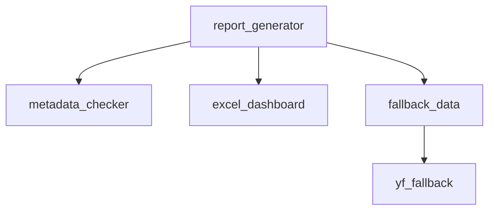

# Reporting Modules

All report generation logic resides under `modules/generate_report/`.
The process downloads profile data, price history and financial statements
for each ticker, writes CSV/JSON files and optionally uploads them to Directus.
Afterwards an Excel dashboard can be created from the CSVs.

## Key Components

- `report_generator.py` – orchestrates profile, price and statement downloads.
- `metadata_checker.py` – re-fetches any files that failed previously.
- `fallback_data.py` – last-resort fetch via pure yfinance/FMP.
- `excel_dashboard.py` – merges CSVs into a workbook with Excel tables.
- `yf_fallback.py` – minimal helper used during troubleshooting.

Portfolio information from `modules.management.portfolio_manager` can be fed
into this workflow to quickly build dashboards for all holdings.
See [report_generation.md](report_generation.md) for a step-by-step guide.

## Diagram

