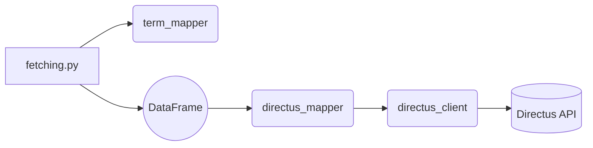

# modules.data

Helpers for retrieving and normalizing data as well as communicating with a Directus instance.

## Provided modules

- **`fetching.py`** – wrappers around `yfinance` and the Financial Modeling Prep (FMP) API. The
  `fetch_basic_stock_data` function tries yfinance first then falls back to FMP
  if data is incomplete.
- **`directus_client.py`** – thin REST client used for CRUD operations against a
  Directus server. Credentials are read from `config/.env` and all helpers return
  `None` on error so offline use is possible. Includes `create_collection_if_missing`
  for automated collection setup.
- **`directus_mapper.py`** – maintains `config/directus_field_map.json` and
  converts local DataFrame columns into the field names expected by Directus.
  `refresh_field_map` queries the server to keep the JSON file up‑to‑date and
  interactive helpers prompt for unmapped columns.
- **`unified_fetcher.py`** – high level wrapper that pulls company data from
  OpenBB first and gracefully falls back to yfinance and FMP. Use
  `fetch_and_store` to push records directly to Directus.
- **`term_mapper.py`** – resolves sector and industry names to a canonical term
  using a JSON map. When an unknown term is encountered the module optionally
  suggests a mapping via OpenAI and then asks the user for confirmation.
- **`compare.py`** – debugging utility that compares company profile data from
  OpenBB with yfinance.

## Data flow

Fetching functions first normalize sectors and industries via `term_mapper`. The
resulting rows can then be prepared for upload using `directus_mapper` and
finally inserted into Directus through `directus_client` if desired.
