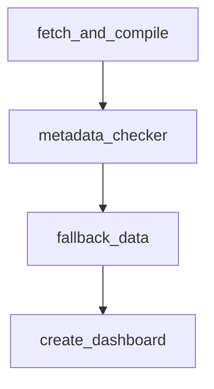

# Generate Report Module

This folder contains the workflow for building Fundalyze ticker reports. Each script focuses on one phase of the process:

1. **`report_generator.py`** – fetch company profile, price history and financial statements using OpenBB. The results are written as CSV and aggregated into a Markdown report along with a `metadata.json` file.
2. **`metadata_checker.py`** – scans existing metadata for entries whose `source` value starts with `ERROR`. Any failed files are re‑fetched via yfinance or FMP and the metadata updated.
3. **`fallback_data.py`** – if data is still missing after the checker, this step performs a full yfinance fallback to repopulate all CSV files.
4. **`excel_dashboard.py`** – converts all ticker CSVs into an Excel workbook where each sheet is an Excel Table. The workbook makes it easy to slice and analyze the results.

The default output root is the `output/` directory at the project root. You can override it by setting the `OUTPUT_DIR` environment variable when running these utilities.

Run the full lifecycle via `scripts/main.py report` or call each step individually.
